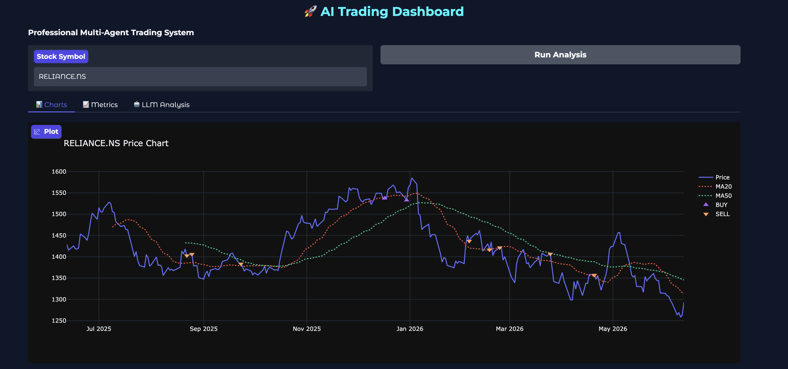
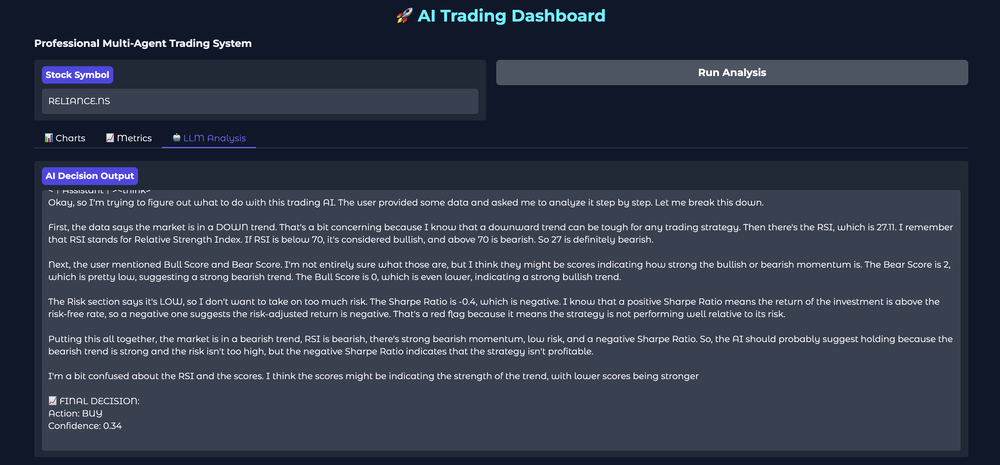
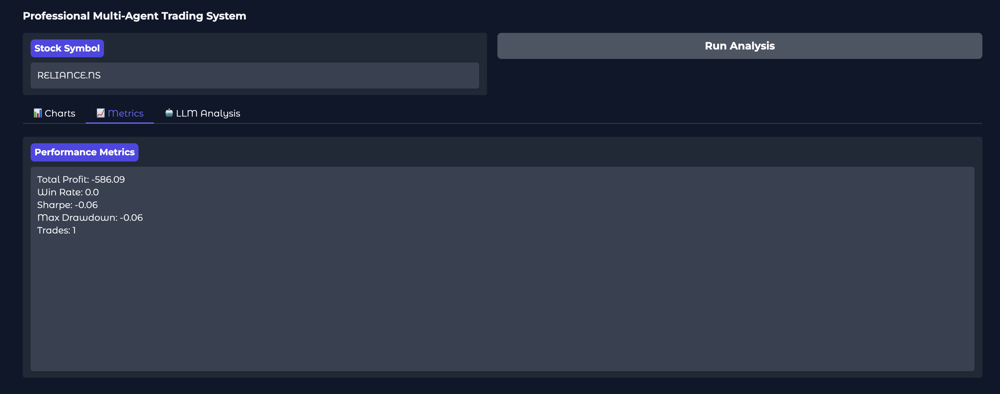
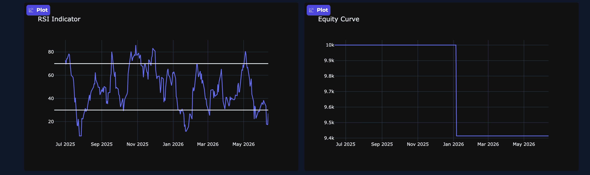

# 🤖 LLM BASED MULTI AGENT TRADING SYSTEM



## Overview

AI Quant Trading Terminal is an intelligent trading research and decision-support platform that combines quantitative analysis, technical indicators, multi-agent reasoning, market regime detection, risk assessment, backtesting, and Large Language Models (LLMs) to generate explainable trading decisions.

The platform analyzes historical market data, computes advanced technical indicators, evaluates market conditions through specialized analytical agents, and produces structured BUY, SELL, or HOLD recommendations along with confidence scores and risk assessments.

Designed for quantitative researchers, algorithmic traders, financial engineers, and AI practitioners, the system demonstrates how modern machine learning and LLM technologies can be integrated into financial decision-making workflows.

---

# VIEW 1 — Main Trading Dashboard


The primary dashboard provides:

* Real-time market analysis
* Trading signal generation
* Technical indicator visualization
* AI-generated market recommendations
* Risk assessment reports
* Trading confidence scores

---

# 🎯 Objectives

The project aims to:

### Market Analysis

Analyze stock market behavior using quantitative methods.

### Trading Signal Generation

Generate structured BUY, SELL, and HOLD recommendations.

### AI-Assisted Decision Making

Utilize LLM reasoning to explain trading decisions.

### Risk Evaluation

Measure market risk before entering trades.

### Backtesting

Evaluate historical strategy performance.

### Portfolio Growth

Improve trading consistency through data-driven analysis.

### Research Automation

Reduce manual analysis using intelligent agents.

---

# Key Features

## 📈 Historical Market Data Analysis

Retrieve and analyze historical market data using Yahoo Finance.

Supported Assets:

* US Stocks
* ETFs
* Indian Stocks
* Global Equities

Examples:

* AAPL
* TSLA
* NVDA
* MSFT
* INFY.NS
* TCS.NS

---

## 🤖 Multi-Agent Trading System

The platform uses specialized agents that independently analyze market conditions.

### Research Agent

Responsible for:

* Trend analysis
* Momentum evaluation
* RSI assessment
* MACD analysis
* Market context generation

---

### Bull Agent

Evaluates bullish evidence including:

* Uptrend confirmation
* Momentum strength
* RSI strength
* Positive technical structure

Produces:

```text
Bullish Score
```

---

### Bear Agent

Evaluates bearish evidence including:

* Downtrend confirmation
* Weak momentum
* Oversold conditions
* Negative technical structure

Produces:

```text
Bearish Score
```

---

### Risk Agent

Evaluates:

* Volatility
* Market uncertainty
* Trade risk levels

Outputs:

```text
LOW RISK
MEDIUM RISK
HIGH RISK
```

---

# System Architecture



```text
Market Data
      │
      ▼
Indicator Engine
      │
      ▼
Research Agent
      │
 ┌────┴─────┐
 ▼          ▼
Bull Agent Bear Agent
      │
      ▼
Risk Agent
      │
      ▼
LLM Decision Engine
      │
      ▼
Trading Recommendation
```

---

# Technical Indicator Engine

The platform computes several quantitative indicators.

## Moving Averages

### MA20

Short-term trend indicator.

### MA50

Long-term trend indicator.

---

## RSI

Relative Strength Index

Used for:

* Overbought detection
* Oversold detection
* Momentum measurement

---

## MACD

Moving Average Convergence Divergence

Used for:

* Trend confirmation
* Momentum shifts
* Entry signals

---

## Signal Line

Used to validate MACD crossovers.

---

## Returns

Percentage price movement.

---

## Volatility

Risk measurement based on return fluctuations.

---

# Trading Signal Engine

The system generates trading signals using multiple factors.

Signal generation considers:

* Trend direction
* RSI levels
* MACD confirmation
* Moving average alignment
* Weekly trend confirmation
* Volatility conditions

Outputs:

```text
BUY
SELL
HOLD
```

---

# 🧠 LLM Trading Intelligence

One of the most innovative components of the platform.

The system integrates a local Large Language Model that:

* Interprets market conditions
* Evaluates quantitative signals
* Produces human-readable explanations
* Generates structured trading recommendations

The LLM acts as an AI investment analyst that converts numerical market information into explainable trading insights.

---

# Confidence Scoring Engine

The platform calculates confidence scores based on:

* Bull score
* Bear score
* Market trend
* Risk profile
* Strategy performance

Outputs:

```text
Confidence: 82%
```

This provides transparency for every recommendation.

---

# 📊 Market Regime Detection



The system automatically identifies:

### Trending Markets

Strong directional movement.

### Sideways Markets

Range-bound behavior.

### High Volatility Markets

Increased uncertainty.

### Low Volatility Markets

Stable conditions.

Market regime information is incorporated into final trading decisions.

---

# Weekly Trend Confirmation

The platform combines:

* Daily timeframe analysis
* Weekly timeframe analysis

Benefits:

* Reduced false signals
* Improved trend confirmation
* Better risk-adjusted entries

---

# Support & Resistance Detection

The system automatically detects:

* Key support zones
* Key resistance zones
* Potential breakout regions
* Reversal levels

Used for:

* Entry timing
* Exit planning
* Risk management

---

# Bollinger Band Analysis

Additional market structure analysis through:

* Upper Band
* Middle Band
* Lower Band

Used for:

* Volatility detection
* Mean reversion opportunities
* Breakout identification

---

# Strategy Backtesting



The backtesting engine evaluates strategy performance on historical data.

Features:

* Trade simulation
* Position tracking
* Equity calculation
* Profit analysis
* Performance measurement

---

# Performance Analytics

The system calculates professional trading metrics.

### Sharpe Ratio

Risk-adjusted return.

### Total Profit

Strategy profitability.

### Win Rate

Percentage of successful trades.

### Average Trade Return

Mean trade performance.

### Volatility

Portfolio risk measurement.

### Equity Growth

Capital appreciation tracking.

---

# Interactive Visualizations

Built with Plotly.

Includes:

* Price charts
* Signal markers
* RSI charts
* Equity curves
* Bollinger Bands
* Support & Resistance levels

Interactive functionality:

* Zoom
* Pan
* Hover analysis
* Dynamic updates

---

# Gradio Dashboard

The platform includes a user-friendly Gradio interface.

Capabilities:

* Asset selection
* Strategy execution
* Market analysis
* AI recommendations
* Performance reporting

Benefits:

* No coding required
* Easy experimentation
* Rapid research workflow

---

# Technology Stack

## Programming Language

* Python

## Financial Data

* Yahoo Finance (yfinance)

## Deep Learning

* PyTorch

## Large Language Models

* Transformers
* Hugging Face

## Data Processing

* Pandas
* NumPy

## Visualization

* Plotly

## User Interface

* Gradio

---

# Methodology

### Step 1

Collect market data.

### Step 2

Generate technical indicators.

### Step 3

Analyze market context.

### Step 4

Evaluate bullish conditions.

### Step 5

Evaluate bearish conditions.

### Step 6

Assess risk profile.

### Step 7

Detect market regime.

### Step 8

Identify support and resistance.

### Step 9

Generate AI trading recommendation.

### Step 10

Backtest strategy performance.

### Step 11

Visualize results through dashboards.

---

# Future Enhancements

Potential improvements include:

* Transformer-based forecasting
* Reinforcement learning agents
* Multi-stock portfolio optimization
* Real-time broker integration
* News sentiment analysis
* RAG-powered financial research
* Autonomous AI trading agents
* Multi-exchange support
* Cloud deployment

---

# Use Cases

Suitable for:

* Quantitative Trading Research
* Financial Machine Learning
* Algorithmic Trading
* AI in Finance
* Market Intelligence
* Trading Education
* Strategy Development
* Investment Research

---

# Disclaimer

This project is intended for educational, research, and experimental purposes only. It does not constitute financial advice or investment recommendations. Trading financial markets involves risk and may result in loss of capital.

---

# Author

Developed as an AI-powered quantitative trading and decision intelligence platform integrating machine learning, technical analysis, multi-agent reasoning, and explainable LLM-based trading recommendations.

⭐ If you find this project useful, consider giving it a star.
# MULTI-AGENT-TRADING-SYSTEM
